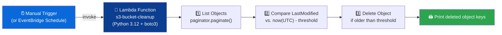

<div align="center">

### AWS DEVOPS ASSIGNMENT

# 🧹 Automated S3 Bucket Cleanup


### 🎯 Automatically delete stale S3 objects older than a retention threshold — zero manual cleanup.

</div>

---

## 📘 Overview

> This assignment automates deletion of **stale objects** in an S3 bucket using a Lambda function. The function paginates through all objects, compares each object's `LastModified` timestamp to the current UTC time, and deletes anything older than the retention window (30 days in production).

| 🔑 Key | Detail |
|---|---|
| **Objective** | Delete S3 objects older than 30 days |
| **Trigger** | Manual test event (can be scheduled via EventBridge) |
| **Core AWS Services** | S3, Lambda, IAM |
| **Language / SDK** | Python 3.12 + boto3 |
| **Author** | *Moana* |

---

## 🗂️ Table of Contents

1. [🏗️ Architecture Diagram](#️-architecture-diagram)
2. [✅ Prerequisites](#-prerequisites)
3. [🪣 Step 1 — S3 Bucket Setup](#-step-1--s3-bucket-setup)
4. [🔐 Step 2 — IAM Role & Policy](#-step-2--iam-role--policy)
5. [🧠 Step 3 — Lambda Function Setup](#-step-3--lambda-function-setup)
6. [🐍 Step 4 — Lambda Code (Boto3)](#-step-4--lambda-code-boto3)
7. [🧪 Step 5 — Testing & Verification](#-step-5--testing--verification)
8. [💬 Discussion — Lambda vs. S3 Lifecycle Rules](#-discussion--lambda-vs-s3-lifecycle-rules)
9. [🏁 Summary](#-summary)

---

## 🏗️ Architecture Diagram



> 💡 **Flow in one line:** `List (paginated) ➜ Compare Age ➜ Delete ➜ Log`

---

## ✅ Prerequisites

- [x] AWS account with Console + CLI access
- [x] An S3 bucket created (or ready to create) with a handful of test objects uploaded
- [x] IAM permissions to create Roles and Lambda functions
- [x] Willingness to temporarily lower the age threshold (e.g. minutes) for testing, then reset to 30 days

---

## 🪣 Step 1 — S3 Bucket Setup

$\Large{\textcolor{#87CEEB}{\textbf{ '**STEP 1   Create the S3 Bucket and Upload Test Files**'  }}}$ 


------------------------------------------------------------------
Selected General Purpose > Added Bucket Name
------------------------------------------------------------------


------------------------------------------------------------------
Checked Block Public Access settings for this bucket
-------------------------------------------------------------------


------------------------------------------------------------------
Uploaded few sample files
--------------------------------------------------------------------


--------------------------------------------------------------------
| Setting | Value |
|---|---|
| **Bucket name** | `dhanas3bucketobjectcleanup` |
| **Region** | e.g. `us-east-1` |
| **Test objects** | Upload 3–5 sample files (`.csv` / `.png`) |


---

## 🔐 Step 2 — IAM Role & Policy

**STEP 2   Create the IAM Role with a Least-Privilege Inline Policy**

**Role name:** `lambda-s3-cleanup-role`

| Action | Purpose |
|---|---|
| `s3:ListBucket` | List/paginate objects in the target bucket |
| `s3:DeleteObject` | Delete objects that exceed the age threshold |

<details>
<summary>📄 <b>Click to expand — Inline IAM Policy JSON</b></summary>

```json
{
  "Version": "2012-10-17",
  "Statement": [
    {
      "Sid": "ListBucketObjects",
      "Effect": "Allow",
      "Action": "s3:ListBucket",
      "Resource": "arn:aws:s3:::dhanas3bucketobjectcleanup"
    },
    {
      "Sid": "DeleteStaleObjects",
      "Effect": "Allow",
      "Action": "s3:DeleteObject",
      "Resource": "arn:aws:s3:::dhanas3bucketobjectcleanup/*"
    },
    {
      "Sid": "AllowCloudWatchLogging",
      "Effect": "Allow",
      "Action": [
        "logs:CreateLogGroup",
        "logs:CreateLogStream",
        "logs:PutLogEvents"
      ],
      "Resource": "*"
    }
  ]
}

```
</details>

📸 **Steps and Screenshot:**

-----------------------------------
Selected AWS services and Lambda
-----------------------------------


-----------------------------------
Created Role
-----------------------------------


-----------------------------------
Created inline Policy
-----------------------------------


-----------------------------------
Verified policy attached to role
----------------------------------


---------------------------------


> ⚠️ **Least privilege:** Both statements are scoped to the specific bucket ARN — never use `"Resource": "*"` for delete permissions in production.

---

## 🧠 Step 3 — Lambda Function Setup

**STEP 3   Create the Lambda Function**

| Setting | Value |
|---|---|
| **Function name** | `s3-stale-object-cleanup` |
| **Runtime** | Python 3.12 |
| **Execution role** | `lambda-s3-cleanup-role` | 
| **Timeout** | 1 min |
| **Env var** `BUCKET_NAME` | `dhanas3bucketobjectcleanup` |
| **Env var** `MAX_AGE_DAYS` | `30` *(temporarily lower for testing)* |

📸 **Steps and Screenshot:**
------------------------------------------
Selected Author from scratch , named s3-stale-object-cleanup
------------------------------------------


------------------------------------------
Expand Change default execution role → select Use an existing role → pick lambda-s3-cleanup-role from the dropdown ..
-----------------------------------------


------------------------------------------
Created Lambda Function
------------------------------------------


-----------------------------------------

---

## 🐍 Step 4 — Lambda Code (Boto3)

<details>
<summary>📄 <b>Click to expand — lambda_function.py</b></summary>

```python
import boto3
from datetime import datetime, timezone, timedelta
# ---- CONFIG ----
BUCKET_NAME = "dhanas3bucketobjectcleanup"     # <-- replace with your bucket
AGE_THRESHOLD_DAYS = 30              # final submission value
# For quick testing only, you may temporarily use minutes instead:
# AGE_THRESHOLD = timedelta(minutes=5)
AGE_THRESHOLD = timedelta(days=AGE_THRESHOLD_DAYS)
s3_client = boto3.client("s3")
def lambda_handler(event, context):
   now_utc = datetime.now(timezone.utc)
   cutoff = now_utc - AGE_THRESHOLD
   deleted_keys = []
   scanned_count = 0
   paginator = s3_client.get_paginator("list_objects_v2")
   # Never assume a single page of results -- always paginate.
   for page in paginator.paginate(Bucket=BUCKET_NAME):
       for obj in page.get("Contents", []):
           scanned_count += 1
           key = obj["Key"]
           last_modified = obj["LastModified"]  # already timezone-aware (UTC)
           if last_modified < cutoff:
               s3_client.delete_object(Bucket=BUCKET_NAME, Key=key)
               deleted_keys.append(key)
               print(f"Deleted stale object: {key} (last modified {last_modified})")
           else:
               print(f"Kept object: {key} (last modified {last_modified})")
   summary = {
       "bucket": BUCKET_NAME,
       "scanned_objects": scanned_count,
       "deleted_count": len(deleted_keys),
       "deleted_keys": deleted_keys,
   }
   print(f"Cleanup summary: {summary}")
   return summary

```
</details>


📸 **Screenshot and steps**
-------------------------------------
Added lambda function code and deployed 
-----------------------------------------


-----------------------------------------
-------------------------------------


--------------------------------------

---

## 🧪 Step 5 — Testing & Verification


📸 **Testing steps and Screenshot:**

🧪 **Test → For testing purpose changed Threshold to 5 mins from 30 days  for testing purpose and Ran Lambda manually**


----------------------------------------------------
1)   Ran Lambda Function with threshold 5 mins 

---------------------------------------------------


---------------------------------------------------

2) In output we can see files are being deleted


--------------------------------------------------

3) In S3 bucket We can see files got  deleted .

 **BEFORE**


**AFTER**


---------------------------------------------

4) We can verify the same in CloudWatch logs

   

-----------------------------------------

| ✅ Check |  Outcome was as Expected |
|---|---|
| Lambda execution status | `Succeeded`, no errors |
| Deleted object count (test run) | Matches objects older than the lowered test threshold |
| Remaining objects | Only newer files present in the bucket |
| Final code | `MAX_AGE_DAYS` reset to `30` before submission |


---

## 💬 Discussion — Lambda vs. S3 Lifecycle Rules

> In production, **S3 Lifecycle Rules** handle age-based deletion natively with **zero code** — they're cheaper, more reliable, and require no maintenance. **Lambda is the better choice** when cleanup needs **conditional logic** Lifecycle Rules can't express: deleting based on **object naming patterns**, **content inspection**, **cross-service actions** (e.g. notify via SNS, log to DynamoDB before deleting), or **business-rule exceptions** that go beyond a simple age threshold.

---


---

## 🏁 Summary

<div align="center">


**List (paginated) ➜ Compare Age ➜ Delete ➜ Log** — a lightweight, serverless housekeeping pattern for object storage.

</div>

---

<div align="center">


</div>
