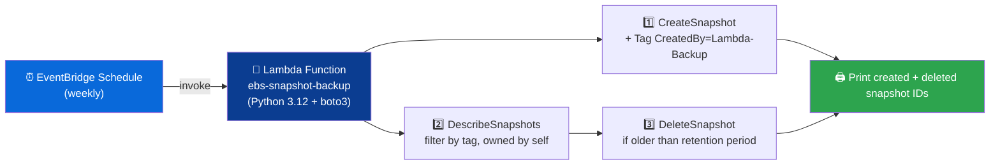

<div align="center">

### AWS DEVOPS ASSIGNMENT

# 💽 Automated EBS Snapshot Backup & Cleanup


### 🎯 Automate weekly EBS backups and prune snapshots past their retention period.

</div>

---

## 📘 Overview

> This assignment automates **EBS volume backups**: a Lambda function creates a tagged snapshot of a target volume, then cleans up old snapshots (older than the retention window) that carry the same tag — running on a **weekly EventBridge schedule**.

| 🔑 Key | Detail |
|---|---|
| **Objective** | Create weekly EBS snapshots and delete ones older than 30 days |
| **Trigger** | EventBridge Schedule (weekly) |
| **Core AWS Services** | EC2, EBS, Lambda, IAM, EventBridge |
| **Language / SDK** | Python 3.12 + boto3 |
| **Author** | *Moana* |

---

## 🗂️ Table of Contents

1. [🏗️ Architecture Diagram](#️-architecture-diagram)
2. [✅ Prerequisites](#-prerequisites)
3. [💽 Step 1 — EBS Volume Setup](#-step-1--ebs-volume-setup)
4. [🔐 Step 2 — IAM Role & Policy](#-step-2--iam-role--policy)
5. [🧠 Step 3 — Lambda Function Setup](#-step-3--lambda-function-setup)
6. [🐍 Step 4 — Lambda Code (Boto3)](#-step-4--lambda-code-boto3)
7. [⏰ Step 5 — EventBridge Weekly Schedule](#-step-5--eventbridge-weekly-schedule)
8. [🧪 Step 6 — Testing & Verification](#-step-6--testing--verification)
9. [💬 Discussion — Lambda vs. AWS Data Lifecycle Manager](#-discussion--lambda-vs-aws-data-lifecycle-manager)
10. [🏁 Summary](#-summary)

---

## 🏗️ Architecture Diagram



> 💡 **Flow in one line:** `Create + Tag Snapshot ➜ List Tagged Snapshots ➜ Delete Expired Ones ➜ Log`

---

## ✅ Prerequisites

- [x] AWS account with Console + CLI access
- [x] An EBS volume identified or created — note its **Volume ID**
- [x] IAM permissions to create Roles, Lambda functions, and EventBridge Schedules

---

## 💽 Step 1 — EBS Volume Setup

| Setting | Value |
|---|---|
| **Volume ID** | `vol-xxxxxxxxxxxxxxxxx` |
| **Availability Zone** | Match your working region's AZ |
| **Size** | Any (8 GiB default is fine for testing) |

📸 **Steps and Screenshots:**

------------------------------------
**Created new Ec2 Instance**
------------------------------------


------------------------------------
**Noted the EBS volume ID**
------------------------------------


------------------------------------


---

## 🔐 Step 2 — IAM Role & Policy

**Role name:** `lambda-ebs-backup-role`

| Action | Purpose |
|---|---|
| `ec2:CreateSnapshot` | Create a new snapshot of the target volume |
| `ec2:DescribeSnapshots` | List existing tagged snapshots to evaluate age |
| `ec2:DeleteSnapshot` | Remove snapshots past the retention window |
| `ec2:CreateTags` | Tag new snapshots for identification (`CreatedBy=Lambda-Backup`) |

<details>
<summary>📄 <b>Click to expand — Inline IAM Policy JSON</b></summary>

```json
{
	"Version": "2012-10-17",
	"Statement": [
		{
			"Sid": "SnapshotLifecycleActions",
			"Effect": "Allow",
			"Action": [
				"ec2:CreateSnapshot",
				"ec2:DescribeSnapshots",
				"ec2:DeleteSnapshot",
				"ec2:CreateTags"
			],
			"Resource": "*"
		},
		{
			"Sid": "AllowCloudWatchLogging",
			"Effect": "Allow",
			"Action": [
				"logs:CreateLogGroup",
				"logs:CreateLogStream",
				"logs:PutLogEvents"
			],
			"Resource": "arn:aws:logs:*:*:*"
		}
	]
}

```
</details>

📸 **Steps and Screenshots:**

------------------------------------
** Created IAM role --> lambda-ebs-snapshot-role **
------------------------------------


------------------------------------
** Added inline policy **
------------------------------------


-----------------------------------

**Confirmed that policy is attached to the role**
-----------------------------------


------------------------------------
## 🧠 Step 3 — Lambda Function Setup

| Setting | Value |
|---|---|
| **Function name** | `ebs-snapshot-lifecycle` |
| **Runtime** | Python 3.12 |
| **Execution role** | `lambda-ebs-snapshot-role` |
| **Timeout** | 1 min |
| **Env var** `VOLUME_ID` | `vol-xxxxxxxxxxxxxxxxx` |
| **Env var** `RETENTION_DAYS` | `30` |

📸 **Steps and Screenshots:**

----------------------------------
**Selected Author from scratch and selected custom execution role lambda-ebs-snapshot-role**
----------------------------------


----------------------------------
**Created Lambda function**
----------------------------------


----------------------------------


---

## 🐍 Step 4 — Lambda Code (Boto3)

<details>
<summary>📄 <b>Click to expand — lambda_function.py</b></summary>

```python

import boto3
from datetime import datetime, timezone, timedelta
# ---- CONFIG ----
VOLUME_ID = "vol-01f8bdd100ec6d30d"   # <-- replace with your EBS volume ID
RETENTION_DAYS = 30                       # final submission value
# For quick testing only, you may temporarily use a smaller window:
# RETENTION_DAYS = 0
TAG_KEY = "CreatedBy"
TAG_VALUE = "Lambda-Backup"
ec2_client = boto3.client("ec2")
def lambda_handler(event, context):
   now_utc = datetime.now(timezone.utc)
   cutoff = now_utc - timedelta(days=RETENTION_DAYS)
   # 1. Create a new snapshot of the target volume
   snapshot = ec2_client.create_snapshot(
       VolumeId=VOLUME_ID,
       Description=f"Automated backup of {VOLUME_ID} via Lambda",
       TagSpecifications=[
           {
               "ResourceType": "snapshot",
               "Tags": [
                   {"Key": TAG_KEY, "Value": TAG_VALUE},
                   {"Key": "SourceVolume", "Value": VOLUME_ID},
               ],
           }
       ],
   )
   created_id = snapshot["SnapshotId"]
   print(f"Created snapshot: {created_id} for volume {VOLUME_ID}")
   # 2. List snapshots owned by this account carrying our tag
   response = ec2_client.describe_snapshots(
       OwnerIds=["self"],
       Filters=[{"Name": f"tag:{TAG_KEY}", "Values": [TAG_VALUE]}],
   )
   deleted_ids = []
   for snap in response.get("Snapshots", []):
       snap_id = snap["SnapshotId"]
       start_time = snap["StartTime"]  # timezone-aware (UTC)
       # Never delete the snapshot we just created in this same run
       if snap_id == created_id:
           continue
       if start_time < cutoff:
           ec2_client.delete_snapshot(SnapshotId=snap_id)
           deleted_ids.append(snap_id)
           print(f"Deleted stale snapshot: {snap_id} (created {start_time})")
       else:
           print(f"Kept snapshot: {snap_id} (created {start_time})")
   summary = {
       "volume_id": VOLUME_ID,
       "created_snapshot": created_id,
       "deleted_count": len(deleted_ids),
       "deleted_snapshots": deleted_ids,
   }
   print(f"Snapshot lifecycle summary: {summary}")
   return summary


```
</details>

📸 **Steps and Screenshots:**


----------------------------------
** Added and deployed Lambda function**
----------------------------------


----------------------------------
**Created test event***

----------------------------------


----------------------------------
** Tested manually ***
----------------------------------


----------------------------------
** Output and functional Logs**
----------------------------------


----------------------------------
***Confirmed new snapshot generated and its generated with our volume id 
----------------------------------


----------------------------------
**Verified CloudWatch logs***
----------------------------------


-------------------------------------
## ⏰ Step 5 — EventBridge Weekly Schedule

| Setting | Chosen Value |
|---|---|
| **Schedule type** | Recurring — `rate(7 days)` or `cron(0 3 ? * MON *)` |
| **Action after completion** | `NONE` (keeps the recurring schedule active) |
| **Execution role** | *Create new role for this schedule* |
| **Target** | `ebs-snapshot-backup` Lambda |

📸 **Steps and Screenshots:**

----------------------------------
** Created weekly EventBridge Schedule
----------------------------------


----------------------------------
***Added EventBridge trigger in lambda function**
----------------------------------


----------------------------------
***Weekly trigger Schedule**
----------------------------------


----------------------------------


---

## 🧪 Step 6 — Testing & Verification


📸 **Steps and Screenshot:**

🧪 **For testing purpose deployed policy policy with 5 minutes threshold**

-------------------------------------
** Changed threshold to 5 minutes ***
-------------------------------------


-------------------------------------
** Manually triggered Lambda function and waited below are Before and After results**
-------------------------------------
*BEFORE trigger there was existing snapshot with Snapshot ID
-------------------------------------


-------------------------------------

*AFTER trigger old snapshot was deleted and new Snapshot generated 
-------------------------------------
**Lambda Function output**


**Old Snapshot deleted and new Snapshot generated**


**Functional Logs**


**Newly generated  Snapshot**


***CloudWatch Logs**


-------------------------------------

| ✅ Check | Expected Outcome |
|---|---|
| Lambda execution status | `Succeeded`, no errors |
| New snapshot | Appears in EC2 → Snapshots, tagged `CreatedBy=Lambda-Backup` |
| Old snapshot cleanup | Snapshots older than `RETENTION_DAYS` removed |
| Logs | Print statements show created + deleted snapshot IDs |

---

## 💬 Discussion — Lambda vs. AWS Data Lifecycle Manager

> **AWS Data Lifecycle Manager (DLM)** natively schedules snapshot creation and retention with **zero code** and is the right default choice for standard backup policies. **Lambda is still the better choice** when you need **custom retention logic** beyond simple age-based rules, **cross-account/cross-region snapshot copies**, or **notifications and downstream automation** (e.g. SNS alerts, updating a CMDB, triggering a restore test) tied to the backup lifecycle.

---

---


## 🏁 Summary

<div align="center">


**Create + Tag ➜ Filter by Tag ➜ Delete Expired ➜ Log** — a self-maintaining backup pipeline running on a weekly clock.

</div>

---

<div align="center">


</div>

