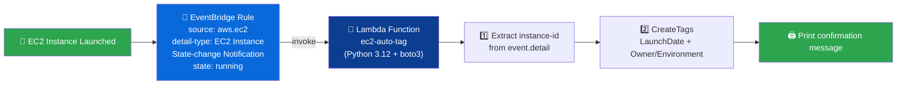

<div align="center">

### AWS DEVOPS ASSIGNMENT

# 🏷️ Auto-Tagging EC2 Instances on Launch


### 🎯 Automatically tag every new EC2 instance for tracking, ownership, and cost allocation — no manual step.

</div>

---

## 📘 Overview

> This assignment automatically tags **newly launched EC2 instances** the moment they enter the `running` state. An **EventBridge rule** listens for EC2 state-change notifications and triggers a Lambda function that extracts the instance ID and applies tracking tags — including a **bonus** enhancement that resolves the launching IAM user from **CloudTrail** for an automatic `Owner` tag.

| 🔑 Key | Detail |
|---|---|
| **Objective** | Auto-tag every EC2 instance on launch (`LaunchDate`, `Owner`/`Environment`) |
| **Trigger** | EventBridge Rule — `EC2 Instance State-change Notification` (state: `running`) |
| **Core AWS Services** | EC2, Lambda, IAM, EventBridge, CloudTrail (bonus) |
| **Language / SDK** | Python 3.12 + boto3 |
| **Author** | *Moana* |

---

## 🗂️ Table of Contents

1. [🏗️ Architecture Diagram](#️-architecture-diagram)
2. [✅ Prerequisites](#-prerequisites)
3. [🔐 Step 1 — IAM Role & Policy](#-step-1--iam-role--policy)
4. [🧠 Step 2 — Lambda Function Setup](#-step-2--lambda-function-setup)
5. [🐍 Step 3 — Lambda Code (Boto3)](#-step-3--lambda-code-boto3)
6. [⚡ Step 4 — EventBridge Rule (Launch Trigger)](#-step-4--eventbridge-rule-launch-trigger)
7. [🧪 Step 5 — Testing & Verification](#-step-5--testing--verification)
8. [🌟 Bonus — Auto-Resolve Owner via CloudTrail](#-bonus--auto-resolve-owner-via-cloudtrail)
9. [🏁 Summary](#-summary)

---

## 🏗️ Architecture Diagram



> 💡 **Flow in one line:** `Instance Enters "running" ➜ EventBridge Fires ➜ Lambda Tags It ➜ Log`

---

## ✅ Prerequisites

- [x] AWS account with Console + CLI access
- [x] Permissions to launch EC2 instances (for testing)
- [x] IAM permissions to create Roles, Lambda functions, and EventBridge Rules
- [x] (Bonus) CloudTrail enabled in the region to look up `RunInstances` events

---

## 🔐 Step 1 — IAM Role & Policy

**Role name:** `lambda-ec2-autotag-role`

| Action | Purpose |
|---|---|
| `ec2:CreateTags` | Apply tags to the newly launched instance |
| `ec2:DescribeInstances` | Confirm instance state / resolve instance metadata |
| `cloudtrail:LookupEvents` *(bonus)* | Find the `RunInstances` event to resolve the launching IAM user |

<details>
<summary>📄 <b>Click to expand — Inline IAM Policy JSON</b></summary>

```json
{
  "Version": "2012-10-17",
  "Statement": [
    {
      "Sid": "AllowTaggingAndDescribe",
      "Effect": "Allow",
      "Action": [
        "ec2:CreateTags",
        "ec2:DescribeInstances"
      ],
      "Resource": "*"
    },
    {
      "Sid": "AllowLambdaLogging",
      "Effect": "Allow",
      "Action": [
        "logs:CreateLogGroup",
        "logs:CreateLogStream",
        "logs:PutLogEvents"
      ],
      "Resource": "arn:aws:logs:*:*:*"
    }
  ]
}

```
</details>

📸 **Steps and Screenshots:**

--------------------------------
*Created IAM Role -->  lambda-ec2-autotag-role
-------------------------------


-------------------------------
*Updated inline policy 
--------------------------------


-------------------------------
Confirmed that inline policy is attached to the Role
-------------------------------


------------------------------

## 🧠 Step 2 — Lambda Function Setup

| Setting | Value |
|---|---|
| **Function name** | `ec2-auto-tagger` |
| **Runtime** | Python 3.12 |
| **Execution role** | `lambda-ec2-autotag-role` |
| **Timeout** | 30 sec |
| **Env var** `DEFAULT_ENVIRONMENT` | `Development` |

📸 **Steps and Screenshots:**

-------------------------------
** Created lambda function and selected Custom execution role
--------------------------------


-------------------------------

---

## 🐍 Step 3 — Lambda Code (Boto3)

<details>
<summary>📄 <b>Click to expand — lambda_function.py</b></summary>

```python
import boto3
import datetime
 
ec2 = boto3.client('ec2')
 
def lambda_handler(event, context):
    # 1. Extract the instance ID from the EventBridge event
    detail = event.get('detail', {})
    instance_id = detail.get('instance-id')
 
    if not instance_id:
        print('No instance-id found in event, skipping.')
        return {'statusCode': 400, 'body': 'Missing instance-id'}
 
    # 2. Build the tag set
    launch_date = datetime.datetime.utcnow().strftime('%Y-%m-%d')
 
    tags = [
        {'Key': 'LaunchDate', 'Value': launch_date},
        {'Key': 'Environment', 'Value': 'Development'},
        {'Key': 'ManagedBy', 'Value': 'auto-tagging-lambda'}
    ]
 
    # 3. Apply the tags to the instance
    ec2.create_tags(Resources=[instance_id], Tags=tags)
 
    # 4. Print a confirmation message
    print(f'Successfully tagged instance {instance_id} '
          f'with LaunchDate={launch_date}')
 
    return {
        'statusCode': 200,
        'body': f'Tagged {instance_id} successfully'
    }

```
</details>

📸 **Screenshot:**

-------------------------------
*Deployed lambda function 
--------------------------------


-------------------------------

---

## ⚡ Step 4 — EventBridge Rule (Launch Trigger)

| Setting | Value |
|---|---|
| **Rule name** | `ec2-launch-autotag-rule` |
| **Event source** | AWS services → EC2 |
| **Target** | `ec2-auto-tag` Lambda function |

<details>
<summary>📄 <b>Click to expand — Event Pattern JSON</b></summary>

```json
{
  "source": ["aws.ec2"],
  "detail-type": ["EC2 Instance State-change Notification"],
  "detail": {
    "state": ["running"]
  }
}
```
</details>

📸 **Steps and Screenshots:**

-------------------------------
**Selected Rule in EventBridge
-------------------------------


-------------------------------
*Updated details and created Rule
-------------------------------


-------------------------------
*EventBridge automatically adds the required resource-based permission to the Lambda function so the rule can invoke it — verify this under the Lambda function's Configuration  →  Permissions  →  Resource-based policy statements.
-------------------------------


-------------------------------


---

## 🧪 Step 5 — Testing & Verification


📸 **Steps and Screenshots for testing:**

-------------------------------
*For testing launched first Ec2 instance and confirmed it moved Running status
--------------------------------


-------------------------------
*Monitored Lambda metrics
-------------------------------


-------------------------------
*Checked CloudWatch logs 
--------------------------------


-------------------------------
*Checked EC2 instanced and confirmed that tags are successfully created
-------------------------------


-------------------------------
*Luanched second EC2 instance  , waited and confirmed tag has been created 
-------------------------------


-------------------------------
*Monitored lambda function metrics
-------------------------------


-------------------------------
*Monitored  Eventbridge metrics
-------------------------------


-------------------------------

---


| ✅ Check | Expected Outcome |
|---|---|
| Launch a new EC2 instance | Instance transitions to `running` |
| EventBridge rule triggers | Rule invocation count increments |
| Lambda execution | `Succeeded`, no errors |
| Tags on instance | `LaunchDate`, `Environment`, `AutoTagged` visible within seconds of launch |
## 🌟 Bonus — Auto-Resolve Owner via CloudTrail

> A popular interview scenario: instead of a static `Owner` tag, look up **who actually launched the instance** via CloudTrail's `RunInstances` event and tag it automatically.

<details>
<summary>📄 <b>Click to expand — CloudTrail Owner Resolution Snippet</b></summary>

```python
import boto3
from datetime import datetime, timedelta, timezone

cloudtrail = boto3.client("cloudtrail")


def resolve_launching_user(instance_id):
    """Look up the IAM identity that called RunInstances for this instance."""
    start_time = datetime.now(timezone.utc) - timedelta(minutes=15)
    response = cloudtrail.lookup_events(
        LookupAttributes=[
            {"AttributeKey": "EventName", "AttributeValue": "RunInstances"}
        ],
        StartTime=start_time,
        EndTime=datetime.now(timezone.utc),
    )

    for event in response.get("Events", []):
        if instance_id in event.get("Resources", [{}]).__str__():
            username = event.get("Username", "unknown")
            return username

    return "unknown"
```

Add to `lambda_handler`:
```python
owner = resolve_launching_user(instance_id)
ec2.create_tags(Resources=[instance_id], Tags=[{"Key": "Owner", "Value": owner}])
print(f"Owner resolved via CloudTrail: {owner}")
```
</details>

📸 **Screenshot:**
```


```

---


---

## 🏁 Summary

<div align="center">


**Launch ➜ EventBridge Detects ➜ Lambda Tags ➜ (Bonus) CloudTrail Resolves Owner** — instant resource tracking and cost allocation with no manual tagging.

</div>

---

<div align="center">


</div>
