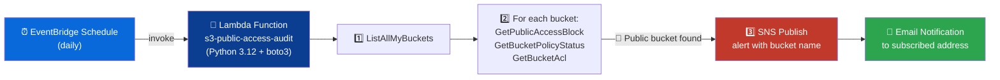

<div align="center">

### AWS DEVOPS ASSIGNMENT

# 🔍 Audit S3 Buckets for Public Access


### 🎯 Detect publicly accessible S3 buckets and alert via SNS — before they become a breach.

</div>

---

## 📘 Overview

> This assignment builds a **daily security audit** that scans every S3 bucket in the account for public exposure — checking **Block Public Access** configuration, **bucket policy status**, and **ACL grants** — and publishes an **SNS email alert** the moment any bucket is found public.

> ⚠️ **Important:** Since April 2023, new buckets have Block Public Access enabled and ACLs disabled by default. A correct audit must check **all three** signals below — ACLs alone are no longer sufficient.

| 🔑 Key | Detail |
|---|---|
| **Objective** | Detect public S3 buckets and notify via SNS |
| **Trigger** | EventBridge Schedule (daily) |
| **Core AWS Services** | S3, Lambda, IAM, SNS, EventBridge |
| **Language / SDK** | Python 3.12 + boto3 |
| **Author** | *Moana* |

---

## 🗂️ Table of Contents

1. [🏗️ Architecture Diagram](#️-architecture-diagram)
2. [✅ Prerequisites](#-prerequisites)
3. [📣 Step 1 — SNS Topic & Subscription](#-step-1--sns-topic--subscription)
4. [🔐 Step 2 — IAM Role & Policy](#-step-2--iam-role--policy)
5. [🧠 Step 3 — Lambda Function Setup](#-step-3--lambda-function-setup)
6. [🐍 Step 4 — Lambda Code (Boto3)](#-step-4--lambda-code-boto3)
7. [⏰ Step 5 — EventBridge Daily Schedule](#-step-5--eventbridge-daily-schedule)
8. [🧪 Step 6 — Testing & Verification](#-step-6--testing--verification)
0. [🏁 Summary](#-summary)

---

## 🏗️ Architecture Diagram



> 💡 **Flow in one line:** `List Buckets ➜ Check 3 Public-Exposure Signals ➜ Publish SNS Alert ➜ Email`


---

## ✅ Prerequisites

- [x] AWS account with Console + CLI access
- [x] IAM permissions to create Roles, Lambda functions, SNS topics, and EventBridge Schedules
- [x] A valid email address to subscribe to the SNS topic
- [x] A disposable **test bucket** you're comfortable temporarily misconfiguring, then re-securing

---

## 📣 Step 1 — SNS Topic & Subscription

| Setting | Value |
|---|---|
| **Topic name** | `s3-public-access-alerts` |
| **Type** | Standard |
| **Subscription protocol** | Email |
| **Subscription endpoint** | your-email@example.com |

> ✉️ After creating the subscription, **confirm it** via the link AWS sends to your inbox — unconfirmed subscriptions won't receive alerts.

📸 **Steps and Screenshots**
```


```

--------------------------------------
** Selected Standard Topic*
--------------------------------------


--------------------------------------
**Created Topic --> s3-public-bucket-alerts
--------------------------------------


--------------------------------------
** Created Subscription
--------------------------------------


--------------------------------------

** Received confirm subscription email
--------------------------------------


--------------------------------------

** Confirmed subscriptions
--------------------------------------
--------------------------------------
Confirmed status of subscription 
--------------------------------------
--------------------------------------
---

## 🔐 Step 2 — IAM Role & Policy

**Role name:** `lambda-s3-audit-role`

| Action | Purpose |
|---|---|
| `s3:ListAllMyBuckets` | Enumerate every bucket in the account |
| `s3:GetBucketPublicAccessBlock` | Check if Block Public Access is enabled per bucket |
| `s3:GetBucketPolicyStatus` | Check the `IsPublic` flag derived from the bucket policy |
| `s3:GetBucketAcl` | Check for public ACL grants (legacy exposure vector) |
| `sns:Publish` | Send the alert to the SNS topic |

<details>
<summary>📄 <b>Click to expand — Inline IAM Policy JSON</b></summary>

```json
{
    "Version": "2012-10-17",
    "Statement": [
        {
            "Sid": "S3ReadOnlyAuditPermissions",
            "Effect": "Allow",
            "Action": [
                "s3:ListAllMyBuckets",
                "s3:GetBucketPublicAccessBlock",
                "s3:GetBucketPolicyStatus",
                "s3:GetBucketAcl",
                "s3:GetBucketLocation"
            ],
            "Resource": "*"
        },
        {
            "Sid": "PublishAuditAlerts",
            "Effect": "Allow",
            "Action": "sns:Publish",
            "Resource": "arn:aws:sns:us-east-1:994114819227:s3-public-bucket-alerts"
        },
        {
            "Sid": "CloudWatchLogsPermissions",
            "Effect": "Allow",
            "Action": [
                "logs:CreateLogGroup",
                "logs:CreateLogStream",
                "logs:PutLogEvents"
            ],
            "Resource": "arn:aws:logs:*:*:*"
        }
    ]
}


```
</details>

📸 **Steps and Screenshots**
```


```
--------------------------------------
** Selected AWS service and lambda 
--------------------------------------
--------------------------------------
** Created role lambda-s3-public-audit-role
--------------------------------------

--------------------------------------
** Created inline policy S3PublicAuditInlinePolicy
--------------------------------------
--------------------------------------

** Confirmed that policy attached to the role
--------------------------------------
--------------------------------------
---

## 🧠 Step 3 — Lambda Function Setup

| Setting | Value |
|---|---|
| **Function name** | `s3-public-access-audit` |
| **Runtime** | Python 3.12 |
| **Execution role** | `lambda-s3-audit-role` |
| **Timeout** | 1 min |
| **Env var** `SNS_TOPIC_ARN` | `arn:aws:sns:us-east-1:<account-id>:s3-public-access-alerts` |

📸 **Steps and Screenshots**
```


```

---

## 🐍 Step 4 — Lambda Code (Boto3)

<details>
<summary>📄 <b>Click to expand — lambda_function.py</b></summary>

```python
import boto3
from botocore.exceptions import ClientError
 
s3 = boto3.client('s3')
sns = boto3.client('sns')
 
# Replace with the ARN copied from Step 1 (SNS topic).
SNS_TOPIC_ARN = 'arn:aws:sns:us-east-1:994114819227:s3-public-bucket-alerts'
 
 
def lambda_handler(event, context):
    """
    Scans every S3 bucket in the account and flags any bucket that
    is genuinely publicly accessible. Runs on a daily EventBridge
    schedule. Publishes one consolidated SNS alert if 1+ buckets
    are flagged, and always logs a full per-bucket audit trail.
    """
    print('Starting S3 public-access audit...')
 
    bucket_names = list_all_buckets()
    print(f'Found {len(bucket_names)} bucket(s) to audit: {bucket_names}')
 
    flagged_buckets = []
 
    for bucket_name in bucket_names:
        verdict = audit_bucket(bucket_name)
        if verdict['is_public']:
            flagged_buckets.append(verdict)
            print(f'[PUBLIC/AT-RISK] {bucket_name} -> {verdict["reasons"]}')
        else:
            print(f'[SAFE] {bucket_name} -> Block Public Access fully enforced, '
                  f'no public policy or ACL detected.')
 
    if flagged_buckets:
        publish_alert(flagged_buckets)
    else:
        print('SUCCESS: Audit complete. No publicly accessible buckets found.')
 
    return {
        'statusCode': 200,
        'body': {
            'buckets_checked': len(bucket_names),
            'buckets_flagged': [b['bucket_name'] for b in flagged_buckets],
        },
    }
 
 
def list_all_buckets():
    response = s3.list_buckets()
    return [b['Name'] for b in response.get('Buckets', [])]
 
 
def audit_bucket(bucket_name):
    """
    Returns a dict describing whether a single bucket is public,
    and WHY, by combining three independent signals: Block Public
    Access status, bucket policy status, and ACL grants.
    """
    reasons = []
 
    # ---- Signal 1: Block Public Access configuration ----
    bpa_fully_enforced = is_block_public_access_fully_enforced(bucket_name)
    if not bpa_fully_enforced:
        reasons.append('Block Public Access is NOT fully enabled on this bucket')
 
    # ---- Signal 2: Bucket policy status (computed by AWS) ----
    policy_is_public = is_bucket_policy_public(bucket_name)
    if policy_is_public:
        reasons.append('Bucket policy grants public access (IsPublic=True)')
 
    # ---- Signal 3: ACL grants (legacy path, still checked) ----
    acl_is_public = does_acl_grant_public_access(bucket_name)
    if acl_is_public:
        reasons.append('Bucket ACL grants access to AllUsers or AuthenticatedUsers')
 
    # A bucket is genuinely at risk only if BPA is not fully locking
    # things down AND at least one of policy/ACL is actually public.
    is_public = (not bpa_fully_enforced) and (policy_is_public or acl_is_public)
 
    return {
        'bucket_name': bucket_name,
        'is_public': is_public,
        'bpa_fully_enforced': bpa_fully_enforced,
        'policy_is_public': policy_is_public,
        'acl_is_public': acl_is_public,
        'reasons': reasons,
    }
 
 
def is_block_public_access_fully_enforced(bucket_name):
    """
    True only if ALL FOUR Block Public Access settings are enabled.
    If the bucket has no BPA configuration at all (older bucket,
    ownership/config edge case), treat it as NOT enforced.
    """
    try:
        response = s3.get_public_access_block(Bucket=bucket_name)
        config = response['PublicAccessBlockConfiguration']
        return all([
            config.get('BlockPublicAcls', False),
            config.get('IgnorePublicAcls', False),
            config.get('BlockPublicPolicy', False),
            config.get('RestrictPublicBuckets', False),
        ])
    except ClientError as err:
        code = err.response['Error']['Code']
        if code == 'NoSuchPublicAccessBlockConfiguration':
            print(f'  -> {bucket_name}: no BPA configuration set at all.')
            return False
        print(f'  -> {bucket_name}: error reading BPA ({code}); treating as NOT enforced.')
        return False
 
 
def is_bucket_policy_public(bucket_name):
    """
    Uses AWS's own computed IsPublic flag rather than parsing the
    policy JSON by hand -- this is the exact API named in the
    assignment (s3:GetBucketPolicyStatus) and is far more reliable
    than manual policy inspection.
    """
    try:
        response = s3.get_bucket_policy_status(Bucket=bucket_name)
        return response['PolicyStatus']['IsPublic']
    except ClientError as err:
        code = err.response['Error']['Code']
        if code == 'NoSuchBucketPolicy':
            return False
        print(f'  -> {bucket_name}: error reading policy status ({code}).')
        return False
 
 
def does_acl_grant_public_access(bucket_name):
    """
    Checks ACL grantees for the two well-known 'public' group URIs.
    Relevant mainly for legacy buckets where ACLs are still enabled.
    """
    public_group_uris = (
        'http://acs.amazonaws.com/groups/global/AllUsers',
        'http://acs.amazonaws.com/groups/global/AuthenticatedUsers',
    )
    try:
        response = s3.get_bucket_acl(Bucket=bucket_name)
        for grant in response.get('Grants', []):
            grantee = grant.get('Grantee', {})
            if grantee.get('URI') in public_group_uris:
                return True
        return False
    except ClientError as err:
        print(f'  -> {bucket_name}: error reading ACL ({err.response["Error"]["Code"]}).')
        return False
 
 
def publish_alert(flagged_buckets):
    bucket_lines = []
    for b in flagged_buckets:
        bucket_lines.append(f"- {b['bucket_name']}: {', '.join(b['reasons'])}")
 
    message = (
        'AWS S3 Public Access Audit ALERT\n'
        f"{len(flagged_buckets)} bucket(s) were found to be publicly "
        'accessible or at risk:\n\n' + '\n'.join(bucket_lines) +
        '\n\nPlease review and remediate immediately.'
    )
 
    sns.publish(
        TopicArn=SNS_TOPIC_ARN,
        Subject='ALERT: Publicly Accessible S3 Bucket(s) Detected',
        Message=message,
    )
    print(f'SNS alert published for {len(flagged_buckets)} flagged bucket(s): '
          f"{[b['bucket_name'] for b in flagged_buckets]}")

```
</details>

📸 **Steps and Screenshots:**
```

```
--------------------------------------
** Selected Author from scratch in lambda function and selected Custome execution role
--------------------------------------
--------------------------------------
** Deployed lambda function
--------------------------------------

--------------------------------------


---

## ⏰ Step 5 — EventBridge Daily Schedule

| Setting | Chosen Value |
|---|---|
| **Schedule type** | Recurring — `rate(1 day)` or `cron(0 6 * * ? *)` |
| **Action after completion** | `NONE` (keeps the recurring schedule active) |
| **Execution role** | *Create new role for this schedule* |
| **Target** | `s3-public-access-audit` Lambda |

📸 **Screenshot:**
```

```
--------------------------------------
** Selected schedule from EventBridge
--------------------------------------
--------------------------------------
** Selected AWS lambda 
--------------------------------------

--------------------------------------
** Selected below options
--------------------------------------
--------------------------------------
** Created schedule 
--------------------------------------
--------------------------------------

---

## 🧪 Step 6 — Testing & Verification

1. 🔓 On a **disposable test bucket**, disable **Block Public Access** and attach a public-read bucket policy.
2. ▶️ Manually trigger the Lambda (Test tab).
3. 📧 Confirm the **SNS email alert** arrives, correctly naming the test bucket and the reason(s) it's public.
4. 🔒 **Immediately re-secure** the test bucket — re-enable Block Public Access and remove the public policy.
5. ▶️ Re-run the Lambda to confirm the bucket no longer triggers an alert.


📸 **Steps and Screenshots:**
```


```

--------------------------------------
*Created  S3 bucket 
--------------------------------------
--------------------------------------
*Unchecked Block Public Access setting for this bucket for testing
--------------------------------------

--------------------------------------
*Edited bucket policy for testing purpose 
--------------------------------------

<details>
<summary>📄 <b>Click to expand — Bucket policy JSON</b></summary>

```json


{
  "Version": "2012-10-17",
  "Statement": [
    {
      "Sid": "PublicReadForTestingOnly",
      "Effect": "Allow",
      "Principal": "*",
      "Action": "s3:GetObject",
      "Resource": "arn:aws:s3:::s3-audit-test-bucket-dhana/*"
    }
  ]
}

```
</details>


--------------------------------------
--------------------------------------
*Now manually invoke lambda function
--------------------------------------
--------------------------------------
**Tested response 
--------------------------------------
--------------------------------------
*Received  email alert about Publicly accessible S3 bucket
--------------------------------------
--------------------------------------
*Verified CloudWatch logs
--------------------------------------
--------------------------------------

*After testing secured bucket again
----------------------------------------------------------------------------
--------------------------------------
*Reinvoked lambda confirmed no public bucket for verification
--------------------------------------
--------------------------------------
*Verified CloudWatch logs and confirmed no bucket has public access
--------------------------------------
--------------------------------------
--------------------------------------
--------------------------------------
---


| ✅ Check | Expected Outcome |
|---|---|
| Public test bucket detected | Appears in `publicBuckets` output + logs |
| SNS alert delivered | Email received with bucket name + reason |
| After re-securing | Bucket no longer flagged on next run |
| Secure buckets | Logged as `✅ Secure`, no false positives |

---

## 🏁 Summary

<div align="center">


**List Buckets ➜ Check PAB + Policy Status + ACLs ➜ Alert via SNS** — a proactive security guardrail that catches misconfigurations before they become incidents.

</div>

---

<div align="center">


</div>

